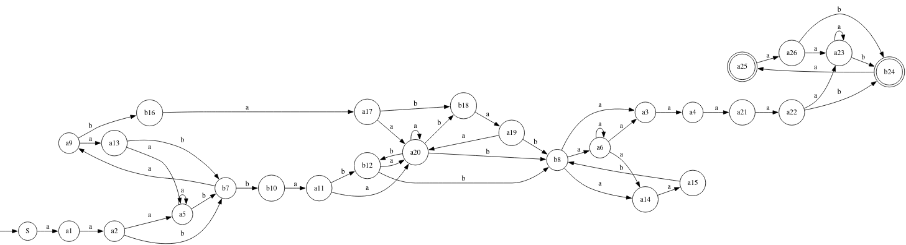
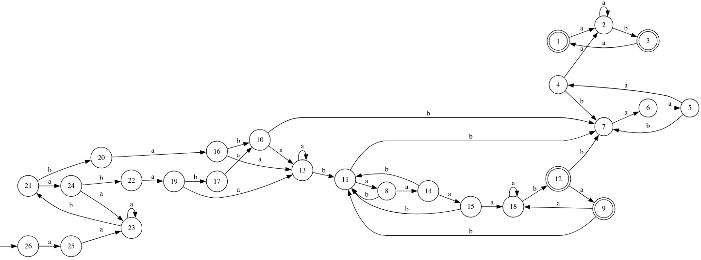
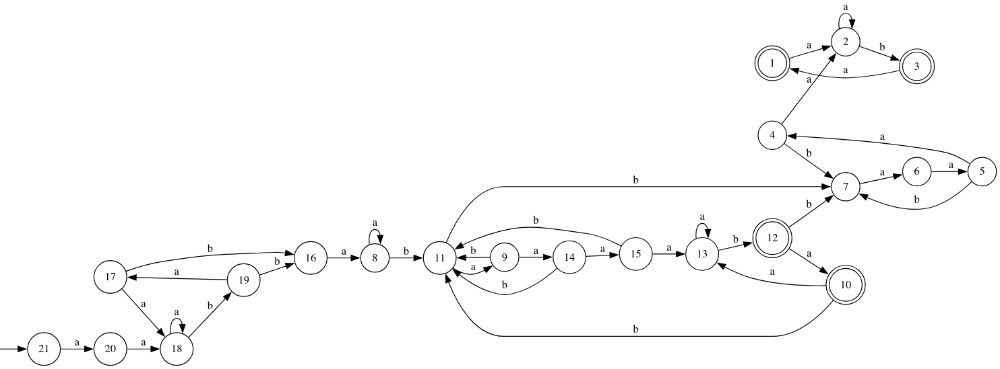

# Лабораторная работа №3.
## Вариант 4
$$L = \{wba^{n+1}ba*w^Rv | w, v \in (aa^+b)^+a?\}$$

## DPDA 

Язык является детерминированным, построим DPDA:


## Беспрефиксность

Язык не является беспрефиксным, например слово $\omega_1 = aabbababaaaab \in L$ и слово $\omega_2 = \omega_1a = aabbababaaaaba \in L$.

Также к любому слову, принадлежащему L и заканчивающемуся на b, можно приписывать $(aa^+b)^*a?$ и слово обудет отаваться в языке, если слово зананчивается на a, то можно прикписывать $a^+b(aa^+b)^*a?$ и слово будет оставаться в языке.

## LL-свойство

### LL(1)-грамматика

Язык обладает LL(1)-свойством, потому что можно построить LL(1)-грамматику G.

$S \rightarrow PV$

$P \rightarrow aaP_1aa$

$P_1 \rightarrow aP_1a | bP_2b \space \space \space \space (First(P_1)=\{a, b\})$

$P_2 \rightarrow aP_5 | baA_1bA_1 \space \space \space \space (First(P_2)=\{a, b\})$

$P_5 \rightarrow aP_1aa | baA_1baA_1 \space \space \space \space (First(P_5)=\{a, b\})$ 

$A_1 \rightarrow aA_1 | \varepsilon \space \space \space \space (First(A_1)=\{a, b\})$

$V \rightarrow aaB$

$B \rightarrow aB | bC \space \space \space \space (First(B)=\{a, b\})$

$C \rightarrow aE | \varepsilon \space \space \space \space$ `(First(C)={a, $})`

$E \rightarrow \varepsilon | aB \space \space \space \space$ `(First(E)={a, $})`

### LL(2)-грамматика $G_1$ без $\varepsilon$-правил

$S \rightarrow PV$

$P \rightarrow aaP_1aa$

$P_1 \rightarrow aP_1a | bP_2b$

$P_2 \rightarrow aP_5 | P_4$

$P_4 \rightarrow bAA_1$

$P_5 \rightarrow aP_1aa | P_3$

$P_3 \rightarrow bAbA$

$A \rightarrow aA | a$

$A_1 \rightarrow b | bA$

$V \rightarrow aaB$

$B \rightarrow aB | b | bE$

$E \rightarrow a | aaB$

## LL(1) аппроксимация сверху

Пронумеруем все нетерминалы в грамматике G

$S \rightarrow PV$

$P \rightarrow a_1a_2P_1a_3a_4$

$P_1 \rightarrow a_5P_1a_6 | b_7P_2b_8$

$P_2 \rightarrow a_9P_5 | b_{10}a_{11}A_1b_{12}A_1$

$P_5 \rightarrow a_{13}P_1a_{14}a_{15} | b_{16}a_{17}A_1b_{18}a_{19}A_1$ 

$A_1 \rightarrow a_{20}A_1 | \varepsilon$

$V \rightarrow a_{21}a_{22}B$

$B \rightarrow a_{23}B | b_{24}C$

$C \rightarrow a_{25}E | \varepsilon$

$E \rightarrow \varepsilon | a_{26}B$

$First(L(G)) = \{a_1\}$

$Last(L(G)) = \{b_{24}, a_{25}\}$

$Follow(L(G)) = \{a_1a_2, a_2a_5, a_2b_7, a_3a_4, a_4a_{21}, a_5a_5, a_5b_7, a_6a_3, a_6a_6, a_6a_{14}, b_7a_9, b_7b_{10}, b_8a_3, b_8a_6, b_8a_{14}, a_9a_{13}, a_9b_{16}, b_{10}a_{11}, a_{11}a_{20}, a_{11}b_{12}, b_{12}a_{20}, b_{12}b_8, \\ 
a_{13}a_5, a_{13}b_7, a_{14}a_{15}, a_{15}b_8, b_{16}a_{17}, a_{17}a_{20}, a_{17}b_{18}, b_{18}a_{19}, a_{19}a_{20}, a_{19}b_8, a_{20}a_{20}, a_{20}b_{12}, a_{20}b_8, a_{20}b_{18}, a_{21}a_{22}, a_{22}a_{23}, a_{22}b_{24}, a_{23}a_{23}, a_{23}b_{24}, b_{24}a_{25}, a_{25}a_{26}, a_{26}a_{23}, a_{26}b_{24}\}$

### LL(1)-автомат



Детерминированный LL(1)-автомат



### Пересечение с исходной грамматикой.

Сначала приведем грамматику  в k-нормальную форму Хомского

$S \rightarrow PV$

$P \rightarrow A_aX_1$

$X_1 \rightarrow A_aX_2$

$X_2 \rightarrow P_1X_3$

$X_3 \rightarrow A_aA_a$

$P_1 \rightarrow A_aX_4$

$X_4 \rightarrow P_1A_a$

$P_1 \rightarrow B_bX_5$

$X_5 \rightarrow P_2B_b$

$P_2 \rightarrow A_aP_5$

$P_2 \rightarrow B_bX_6$

$X_6 \rightarrow AA_1$

$P_5 \rightarrow A_aX_2$

$P_5 \rightarrow B_bX_7$

$X_7 \rightarrow AX_8$

$X_8 \rightarrow B_bA$

$A \rightarrow A_aA$

$A \rightarrow a$

$A_1 \rightarrow b$

$A_1 \rightarrow B_bA$

$V \rightarrow A_aX_9$

$X_9 \rightarrow A_aB$

$B \rightarrow B_bE$

$B \rightarrow A_aB$

$B \rightarrow b$

$E \rightarrow A_aX_9$

$E \rightarrow a$

$A_a \rightarrow a$

$B_b \rightarrow b$

Пересечение грамматики и LL(1)-автомата было выполнено программно и находится в файле intersection_grammar_ll1.txt

## LR(0) аппроксимация сверху

Построим позиционный автомат для грамматики без $\varepsilon$-правил $G_1$.


На картинка плохо видно поэтому можно так
```
digraph DFA {
    rankdir=LR;
    node [shape=box];
	start [shape=plaintext,label=""];
    start -> 0;

    0 [label="S' -> .S 
P -> .aaP1aa
S -> .PV"];
    1 [label="S -> P.V
V -> .aaB"];
    2 [label="P -> a.aP1aa"];
    3 [label="V -> a.aB"];
    4 [label="S -> PV."];
    5 [label="P1 -> .bP2b
P -> aa.P1aa
P1 -> .aP1a"];
    6 [label="V -> aa.B
B -> .b
B -> .aB
B -> .bE"];
    7 [label="P1 -> .bP2b
P1 -> .aP1a
P1 -> a.P1a"];
    8 [label="P2 -> .P4
P1 -> b.P2b
P4 -> .bAA1
P2 -> .aP5"];
    9 [label="P -> aaP1.aa"];
    10 [label="V -> aaB."];
    11 [label="B -> .aB
B -> a.B
B -> .b
B -> .bE"];
    12 [label="E -> .aaB
B -> b.E
B -> b.
E -> .a"];
    13 [label="P1 -> aP1.a"];
    14 [label="P1 -> bP2.b"];
    15 [label="P5 -> .P3
P3 -> .bAbA
P2 -> a.P5
P5 -> .aP1aa"];
    16 [label="P2 -> P4."];
    17 [label="A -> .a
A -> .aA
P4 -> b.AA1"];
    18 [label="P -> aaP1a.a"];
    19 [label="B -> aB."];
    20 [label="E -> a.aB
E -> a."];
    21 [label="B -> bE."];
    22 [label="P1 -> aP1a."];
    23 [label="P1 -> bP2b."];
    24 [label="P1 -> .bP2b
P1 -> .aP1a
P5 -> a.P1aa"];
    25 [label="A -> .a
A -> .aA
P3 -> b.AbA"];
    26 [label="P5 -> P3."];
    27 [label="P2 -> aP5."];
    28 [label="A -> .a
A -> a.
A -> a.A
A -> .aA"];
    29 [label="A1 -> .bA
A1 -> .b
P4 -> bA.A1"];
    30 [label="P -> aaP1aa."];
    31 [label="B -> .aB
E -> aa.B
B -> .b
B -> .bE"];
    32 [label="P5 -> aP1.aa"];
    33 [label="P3 -> bA.bA"];
    34 [label="A -> aA."];
    35 [label="A -> .a
A1 -> b.A
A1 -> b.
A -> .aA"];
    36 [label="P4 -> bAA1."];
    37 [label="E -> aaB."];
    38 [label="P5 -> aP1a.a"];
    39 [label="A -> .a
A -> .aA
P3 -> bAb.A"];
    40 [label="A1 -> bA."];
    41 [label="P5 -> aP1aa."];
    42 [label="P3 -> bAbA."];
    43 [label="S' -> S."]
    43 [shape=doublecircle]

    0 -> 2 [label="a"];
    1 -> 3 [label="a"];
    2 -> 5 [label="a"];
    3 -> 6 [label="a"];
    5 -> 7 [label="a"];
    5 -> 8 [label="b"];
    6 -> 11 [label="a"];
    6 -> 12 [label="b"];
    7 -> 7 [label="a"];
    7 -> 8 [label="b"];
    8 -> 15 [label="a"];
    8 -> 17 [label="b"];
    9 -> 18 [label="a"];
    11 -> 11 [label="a"];
    11 -> 12 [label="b"];
    12 -> 20 [label="a"];
    13 -> 22 [label="a"];
    14 -> 23 [label="b"];
    15 -> 24 [label="a"];
    15 -> 25 [label="b"];
    17 -> 28 [label="a"];
    18 -> 30 [label="a"];
    20 -> 31 [label="a"];
    24 -> 7 [label="a"];
    24 -> 8 [label="b"];
    25 -> 28 [label="a"];
    28 -> 28 [label="a"];
    29 -> 35 [label="b"];
    31 -> 11 [label="a"];
    31 -> 12 [label="b"];
    32 -> 38 [label="a"];
    33 -> 39 [label="b"];
    35 -> 28 [label="a"];
    38 -> 41 [label="a"];
    39 -> 28 [label="a"];

    30 -> 1 [label=ε];
    10 -> 4 [label=ε];
    22 -> 9 [label=ε];
    23 -> 9 [label=ε];
    12 -> 10 [label=ε];
    19 -> 10 [label=ε];
    21 -> 10 [label=ε];
    22 -> 13 [label=ε];
    16 -> 14 [label=ε];
    27 -> 14 [label=ε];
    36 -> 16 [label=ε];
    12 -> 19 [label=ε];
    19 -> 19 [label=ε];
    21 -> 19 [label=ε];
    20 -> 21 [label=ε];
    37 -> 21 [label=ε];
    42 -> 26 [label=ε];
    41 -> 27 [label=ε];
    28 -> 29 [label=ε];
    34 -> 29 [label=ε];
    22 -> 32 [label=ε];
    28 -> 33 [label=ε];
    34 -> 33 [label=ε];
    28 -> 34 [label=ε];
    34 -> 34 [label=ε];
    35 -> 36 [label=ε];
    40 -> 36 [label=ε];
    12 -> 37 [label=ε];
    19 -> 37 [label=ε];
    21 -> 37 [label=ε];
    28 -> 40 [label=ε];
    34 -> 40 [label=ε];
    28 -> 42 [label=ε];
    34 -> 42 [label=ε];
    
    23 -> 13 [label=ε];
    23 -> 32 [label=ε];
    26 -> 27 [label=ε];
    4 -> 43 [label=ε];
}
```
После устранения $\varepsilon$-переходов и недетерминизма получим LR(0) ДКА



Пересечение этого автомата с грамматикой находится в файле intersection_grammar_lr0.txt