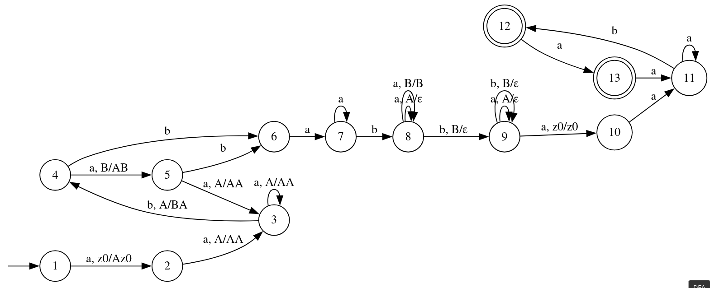
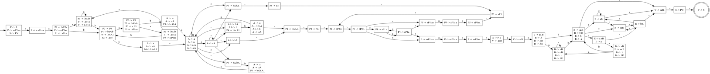

# Лабораторная работа №3.
## Вариант 4
$$L = \{ wba^{n+1}ba^*w^Rv | w, v \in (aa^+b)^+a?\} $$

## DPDA 

Язык является детерминированным, построим DPDA:

## Беспрефиксность

Язык не является беспрефиксным, например слово $\omega_1 = aabbababaaaab \in L$ и слово $\omega_2 = \omega_1a = aabbababaaaaba \in L$.

Также к любому слову, принадлежащему L и заканчивающемуся на b, можно приписывать $(aa^+b)^*a?$ и слово обудет отаваться в языке, если слово зананчивается на a, то можно прикписывать $a^+b(aa^+b)^*a?$ и слово будет оставаться в языке.

## LL-свойство

### LL(1)-грамматика

Язык обладает LL(1)-свойством, потому что можно построить LL(1)-грамматику G.

$S \rightarrow PV$

$P \rightarrow aaP_1aa$

$P_1 \rightarrow aP_1a | bP_2b \space \space \space \space (First(P_1)=\{a, b\})$

$P_2 \rightarrow aP_5 | baA_1bA_1 \space \space \space \space (First(P_2)=\{a, b\})$

$P_5 \rightarrow aP_1aa | baA_1baA_1 \space \space \space \space (First(P_5)=\{a, b\})$ 

$A_1 \rightarrow aA_1 | \varepsilon \space \space \space \space (First(A_1)=\{a, b\})$

$V \rightarrow aaB$

$B \rightarrow aB | bC \space \space \space \space (First(B)=\{a, b\})$

$C \rightarrow aE | \varepsilon \space \space \space \space$ `(First(C)={a, $})`

$E \rightarrow \varepsilon | aB \space \space \space \space$ `(First(E)={a, $})`

### LL(2)-грамматика $G_1$ без $\varepsilon$-правил

$S \rightarrow PV$

$P \rightarrow aaP_1aa$

$P_1 \rightarrow aP_1a | bP_2b$

$P_2 \rightarrow aP_5 | P_4$

$P_4 \rightarrow bAA_1$

$P_5 \rightarrow aP_1aa | P_3$

$P_3 \rightarrow bAbA$

$A \rightarrow aA | a$

$A_1 \rightarrow b | bA$

$V \rightarrow aaB$

$B \rightarrow aB | b | bE$

$E \rightarrow a | aaB$

## LL(1) аппроксимация сверху

Пронумеруем все нетерминалы в грамматике G

$S \rightarrow PV$

$P \rightarrow a_1a_2P_1a_3a_4$

$P_1 \rightarrow a_5P_1a_6 | b_7P_2b_8$

$P_2 \rightarrow a_9P_5 | b_{10}a_{11}A_1b_{12}A_1$

$P_5 \rightarrow a_{13}P_1a_{14}a_{15} | b_{16}a_{17}A_1b_{18}a_{19}A_1$ 

$A_1 \rightarrow a_{20}A_1 | \varepsilon$

$V \rightarrow a_{21}a_{22}B$

$B \rightarrow a_{23}B | b_{24}C$

$C \rightarrow a_{25}E | \varepsilon$

$E \rightarrow \varepsilon | a_{26}B$

$First(L(G)) = \{a_1\}$

$Last(L(G)) = \{b_{24}, a_{25}\}$

$Follow(L(G)) = \{a_1a_2, a_2a_5, a_2b_7, a_3a_4, a_4a_{21}, a_5a_5, a_5b_7, a_6a_3, a_6a_6, a_6a_{14}, b_7a_9, b_7b_{10}, b_8a_3, b_8a_6, b_8a_{14}, a_9a_{13}, a_9b_{16}, b_{10}a_{11}, a_{11}a_{20}, a_{11}b_{12}, b_{12}a_{20}, b_{12}b_8, \\ 
a_{13}a_5, a_{13}b_7, a_{14}a_{15}, a_{15}b_8, b_{16}a_{17}, a_{17}a_{20}, a_{17}b_{18}, b_{18}a_{19}, a_{19}a_{20}, a_{19}b_8, a_{20}a_{20}, a_{20}b_{12}, a_{20}b_8, a_{20}b_{18}, a_{21}a_{22}, a_{22}a_{23}, a_{22}b_{24}, a_{23}a_{23}, a_{23}b_{24}, b_{24}a_{25}, a_{25}a_{26}, a_{26}a_{23}, a_{26}b_{24}\}$

### LL(1)-автомат

Детерминированный LL(1)-автомат

### Пересечение с исходной грамматикой.

Сначала приведем грамматику  в k-нормальную форму Хомского

$S \rightarrow PV$

$P \rightarrow A_aX_1$

$X_1 \rightarrow A_aX_2$

$X_2 \rightarrow P_1X_3$

$X_3 \rightarrow A_aA_a$

$P_1 \rightarrow A_aX_4$

$X_4 \rightarrow P_1A_a$

$P_1 \rightarrow B_bX_5$

$X_5 \rightarrow P_2B_b$

$P_2 \rightarrow A_aP_5$

$P_2 \rightarrow B_bX_6$

$X_6 \rightarrow AA_1$

$P_5 \rightarrow A_aX_2$

$P_5 \rightarrow B_bX_7$

$X_7 \rightarrow AX_8$

$X_8 \rightarrow B_bA$

$A \rightarrow A_aA$

$A \rightarrow a$

$A_1 \rightarrow b$

$A_1 \rightarrow B_bA$

$V \rightarrow A_aX_9$

$X_9 \rightarrow A_aB$

$B \rightarrow B_bE$

$B \rightarrow A_aB$

$B \rightarrow b$

$E \rightarrow A_aX_9$

$E \rightarrow a$

$A_a \rightarrow a$

$B_b \rightarrow b$

Пересечение грамматики и LL(1)-автомата было выполнено программно и находится в файле [intersection_grammar_ll1.txt](grammars/intersection_grammar_ll1.txt)

## LR(0) аппроксимация сверху

Построим позиционный автомат для грамматики без $\varepsilon$-правил $G_1$.

Получившийся автомат в файле [lr0.dot](img/lr0.dot)

После устранения $\varepsilon$-переходов и недетерминизма получим LR(0) ДКА

Пересечение этого автомата с грамматикой находится в файле [intersection_grammar_lr0.txt](grammars/intersection_grammar_lr0.txt)